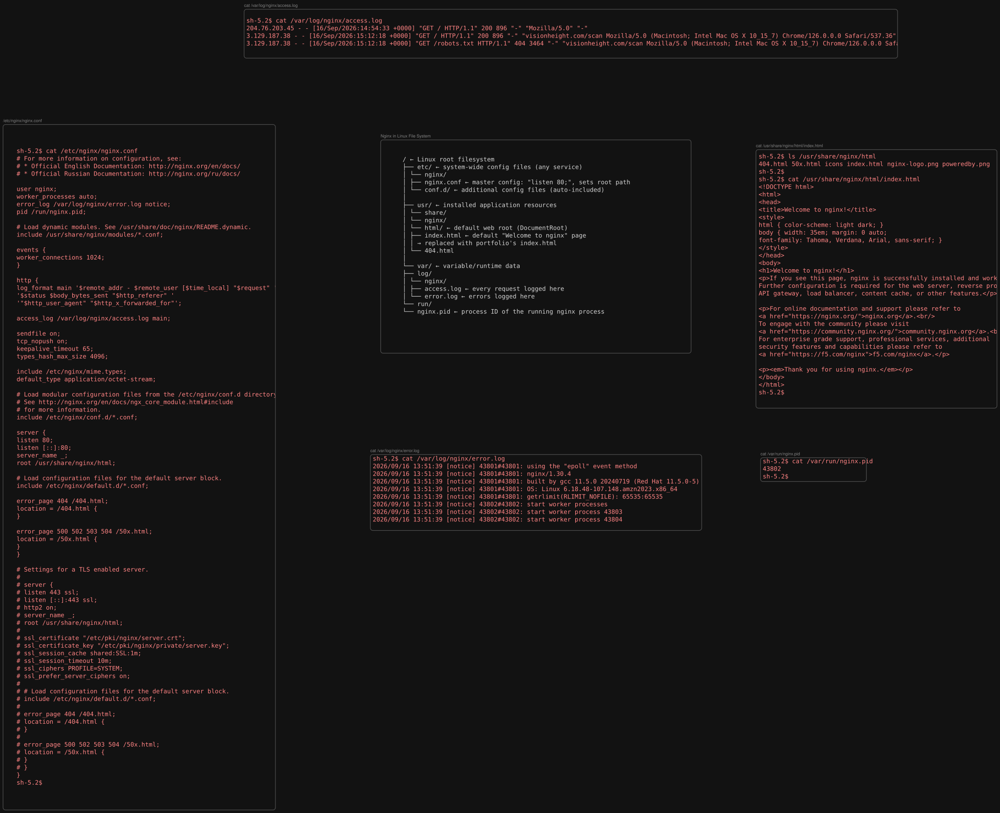

# InfoDesk Cloud / DevOps Practical Test — Report

This document walks through both questions of the practical test step by step, with supporting screenshots from the `Screenshots/Q1` and `Screenshots/Q2` folders of the repository.

---
## Video Walkthroughs

- **Question 1:** [https://youtu.be/by3Ddl82ir4?si=K49ynU28HhK2_E7F](https://youtu.be/by3Ddl82ir4?si=K49ynU28HhK2_E7F)
- **Question 2:** [https://youtu.be/wBaQxQNPW8k?si=EEk2CHd-aZ9POicz](https://youtu.be/wBaQxQNPW8k?si=EEk2CHd-aZ9POicz)
## Question 1 – AWS EC2 + CloudWatch Monitoring

---

### 1. IAM Role for SSM Access

An IAM role was created for AWS Systems Manager before launching the instance, so the instance could be managed via **Session Manager** instead of SSH — removing the need to expose any SSH port to the internet.


### 2. Launching the EC2 Instance

An Amazon Linux EC2 instance was launched with the SSM instance profile attached, no key pair, and a security group allowing **inbound HTTP (port 80) only** — SSH (port 22) was left closed.


### 3. Connecting via Session Manager

The instance was accessed through **SSM Session Manager**, confirming the IAM instance profile was attached correctly and no SSH access was required.


### 4. Installing & Configuring Nginx

Packages were updated, Nginx was installed and started, and configured with `systemctl enable` so it comes back up automatically after any instance reboot.


Nginx's on-disk layout (configuration, web root, logs, PID file) is summarized below:



### 5. Deploying the Portfolio Site

Git was installed so the portfolio repository could be cloned, after which the default Nginx web root was replaced with the portfolio files and Nginx was reloaded to serve the new site.


### 6. Setting Up SNS for Alerts

An SNS topic was created (Standard type, since ordering wasn't needed) with an email subscription to receive CloudWatch alarm notifications.


### 7. CloudWatch Monitoring & Alarm

Detailed monitoring (1-minute metric granularity) was enabled on the instance, and a CloudWatch alarm was created to trigger when CPU utilization crosses **70%**, wired to the SNS topic. A custom CloudWatch dashboard was set up to track CPU usage in real time.


### 8. Testing the Alarm

CPU load was generated artificially on the instance to cross the 70% threshold. The dashboard reflected the spike, the alarm fired, an email notification was received, and the instance was automatically stopped as configured in the alarm action.


### 9. Troubleshooting Walkthrough

The instance was restarted and CPU load was spiked again to demonstrate a manual troubleshooting flow: identifying the high-CPU process with `top`, then stopping it with `killall`, and confirming CPU usage returned to normal.


---

## Question 2 – Terraform + AWS Infrastructure

The full Terraform configuration is in [`Q2 files/`](./Q2%20files) (`main.tf`, `variables.tf`, `outputs.tf`, `user_data.sh`). It provisions the same kind of VPC + EC2 + Nginx + CloudWatch setup as Question 1, but entirely as code.

### Terraform Configuration Files

#### `main.tf`

```hcl
terraform {
  required_providers {
    aws = {
      source  = "hashicorp/aws"
      version = "~> 6.0"
    }
  }
}

provider "aws" {
  region = var.aws_region
}

#^ ---------- Networking ----------

resource "aws_vpc" "main" {
  cidr_block           = "10.0.0.0/16"
  enable_dns_support   = true
  enable_dns_hostnames = true

  tags = {
    Name = "infodesk-test-vpc"
  }
}

resource "aws_subnet" "public" {
  vpc_id                  = aws_vpc.main.id
  cidr_block               = "10.0.1.0/24"
  map_public_ip_on_launch  = true
  availability_zone        = "${var.aws_region}a"

  tags = {
    Name = "infodesk-test-public-subnet"
  }
}

resource "aws_internet_gateway" "igw" {
  vpc_id = aws_vpc.main.id

  tags = {
    Name = "infodesk-test-igw"
  }
}

resource "aws_route_table" "public" {
  vpc_id = aws_vpc.main.id

  route {
    cidr_block = "0.0.0.0/0"
    gateway_id = aws_internet_gateway.igw.id
  }

  tags = {
    Name = "infodesk-test-public-rt"
  }
}

resource "aws_route_table_association" "public" {
  subnet_id      = aws_subnet.public.id
  route_table_id = aws_route_table.public.id
}

#^ ---------- Security Group ----------

resource "aws_security_group" "web_sg" {
  name        = "infodesk-test-web-sg"
  description = "Allow HTTP only"
  vpc_id      = aws_vpc.main.id

  ingress {
    description = "HTTP"
    from_port   = 80
    to_port     = 80
    protocol    = "tcp"
    cidr_blocks = ["0.0.0.0/0"]
  }

  egress {
    from_port   = 0
    to_port     = 0
    protocol    = "-1"
    cidr_blocks = ["0.0.0.0/0"]
  }

  tags = {
    Name = "infodesk-test-web-sg"
  }
}

#^ ---------- AMI lookup (always gets the latest Amazon Linux 2023) ----------

data "aws_ami" "amazon_linux" {
  most_recent = true
  owners      = ["amazon"]

  filter {
    name   = "name"
    values = ["al2023-ami-*-x86_64"]
  }
}

#^ ---------- IAM role for SSM (so we can connect without SSH) ----------

resource "aws_iam_role" "ssm_role" {
  name = "infodesk-test-tf-ssm-role"

  assume_role_policy = jsonencode({
    Version = "2012-10-17"
    Statement = [
      {
        Action = "sts:AssumeRole"
        Effect = "Allow"
        Principal = {
          Service = "ec2.amazonaws.com"
        }
      }
    ]
  })
}

resource "aws_iam_role_policy_attachment" "ssm_attach" {
  role       = aws_iam_role.ssm_role.name
  policy_arn = "arn:aws:iam::aws:policy/AmazonSSMManagedInstanceCore"
}

resource "aws_iam_instance_profile" "ssm_profile" {
  name = "infodesk-test-tf-ssm-profile"
  role = aws_iam_role.ssm_role.name
}

#^ ---------- EC2 Instance ----------

resource "aws_instance" "web" {
  ami                    = data.aws_ami.amazon_linux.id
  instance_type          = var.instance_type
  subnet_id              = aws_subnet.public.id
  vpc_security_group_ids = [aws_security_group.web_sg.id]
  iam_instance_profile   = aws_iam_instance_profile.ssm_profile.name
  user_data              = file("user_data.sh")

  tags = {
    Name = "infodesk-test-tf-web"
  }
}

#^ ---------- SNS for alerts ----------

resource "aws_sns_topic" "cpu_alerts" {
  name = "infodesk-test-tf-cpu-alerts"
}

resource "aws_sns_topic_subscription" "email" {
  topic_arn = aws_sns_topic.cpu_alerts.arn
  protocol  = "email"
  endpoint  = var.alert_email
}

#^ ---------- CloudWatch Alarm ----------

resource "aws_cloudwatch_metric_alarm" "high_cpu" {
  alarm_name          = "infodesk-test-tf-high-cpu"
  comparison_operator = "GreaterThanThreshold"
  evaluation_periods  = 1
  metric_name         = "CPUUtilization"
  namespace           = "AWS/EC2"
  period              = 60
  statistic           = "Average"
  threshold           = 70
  alarm_description   = "Alarm when CPU exceeds 70%"

  dimensions = {
    InstanceId = aws_instance.web.id
  }

  alarm_actions = [
    aws_sns_topic.cpu_alerts.arn,
    "arn:aws:automate:${var.aws_region}:ec2:reboot"
  ]
}
```

#### `variables.tf`

```hcl
variable "aws_region" {
  description = "AWS region to deploy into"
  type        = string
  default     = "us-east-1"
}

variable "instance_type" {
  description = "EC2 instance type"
  type        = string
  default     = "t3.micro"
}

variable "alert_email" {
  description = "Email address to receive CPU alarm notifications"
  type        = string
  default     = "bhavikavgiyanani@gmail.com"
}
```

#### `outputs.tf`

```hcl
output "instance_id" {
  description = "ID of the EC2 instance"
  value       = aws_instance.web.id
}

output "instance_public_ip" {
  description = "Public IP of the EC2 instance"
  value       = aws_instance.web.public_ip
}

output "vpc_id" {
  description = "ID of the VPC"
  value       = aws_vpc.main.id
}

output "alarm_name" {
  description = "Name of the CloudWatch alarm"
  value       = aws_cloudwatch_metric_alarm.high_cpu.alarm_name
}
```

#### `user_data.sh`

```bash
#!/bin/bash
dnf update -y
dnf install -y git nginx
systemctl enable nginx
systemctl start nginx

# Deploy portfolio
git clone https://github.com/Bhavika-Giyanani/Portfolio.git /tmp/portfolio/
rm -rf /usr/share/nginx/html/*
cp -r /tmp/portfolio/* /usr/share/nginx/html/
systemctl reload nginx
```

### 1. AWS Authentication

The AWS CLI was authenticated with the account used for the test, so Terraform could deploy to it.


### 2. Initializing Terraform

`terraform init` was run to download the AWS provider and initialize the working directory.


### 3. Validating & Planning

The configuration was validated and planned to preview the resources Terraform would create — VPC, subnet, internet gateway, route table, security group, IAM role/instance profile, EC2 instance, SNS topic/subscription, and CloudWatch alarm.


The VPC and subnet CIDR blocks were sized with the following IP counts in mind:


### 4. SNS Subscription for Alerts

As with Question 1, an SNS email subscription was created (this time provisioned by Terraform) to deliver CloudWatch alarm notifications.


### 5. Applying the Configuration

`terraform apply` provisioned all resources in one pass — including the EC2 instance, which bootstraps itself via `user_data.sh` (installing Nginx and deploying the portfolio site automatically, with no manual steps).


### 6. Destroying the Infrastructure

After verifying the deployment and reviewing a configuration change with `terraform plan`, all resources were torn down cleanly with `terraform destroy`.


---
